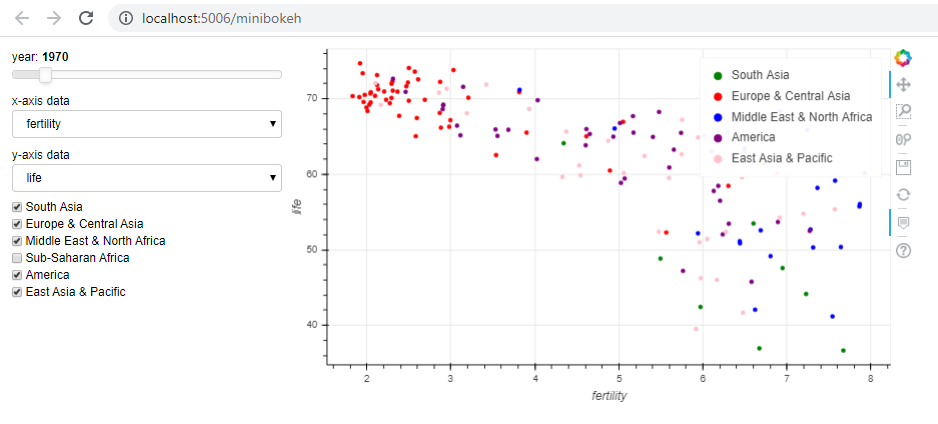

# MiniBokeh - Bokeh dashboard
> This project is a dashboard visualizing data about relation between fertility, population, child mortality and gdp in some regions overtime with Bokeh interactive plotting. 

## General info
This is an exercise from Datacamp sourse: Interactive Data Visualization with Bokeh at 'https://www.datacamp.com/courses/interactive-data-visualization-with-bokeh' ' with some modifications, adding more Bokeh interactive models. I use this project as a way to summarize my skills after 2 months of studying Python for Data science. 

## Screenshots

## Technologies
* Python 3.8.0
* Jupyter Notebook 6.0.1
* bokeh 0.12.16

## Setup
Run command: 'bokeh serve --show minibokeh' at directory contains minibokeh folder. This will open a a dashboard in browser at 
'localhost:5006'

## Features
Give users powerful customization of using dashboard
* Change factor in x and y axis
* Simplify plot by adding or eliminating regions
* Change year of plotting

To-do list:
* Add a pie chart to represent proportion in each regions
* Add more tabs to dive into analyzing dataset

## Status
Project is:  _finished_

## Inspiration
* The idea comes from: 'https://www.datacamp.com/courses/interactive-data-visualization-with-bokeh
* Structure of project and modules references 'https://towardsdatascience.com/data-visualization-with-bokeh-in-python-part-iii-a-complete-dashboard-dc6a86aa6e23' and 'https://github.com/WillKoehrsen/Bokeh-Python-Visualization'

## Contact
Created by Phu Vinh Nguyen (Vinh Nguyen) - feel free to contact me!
